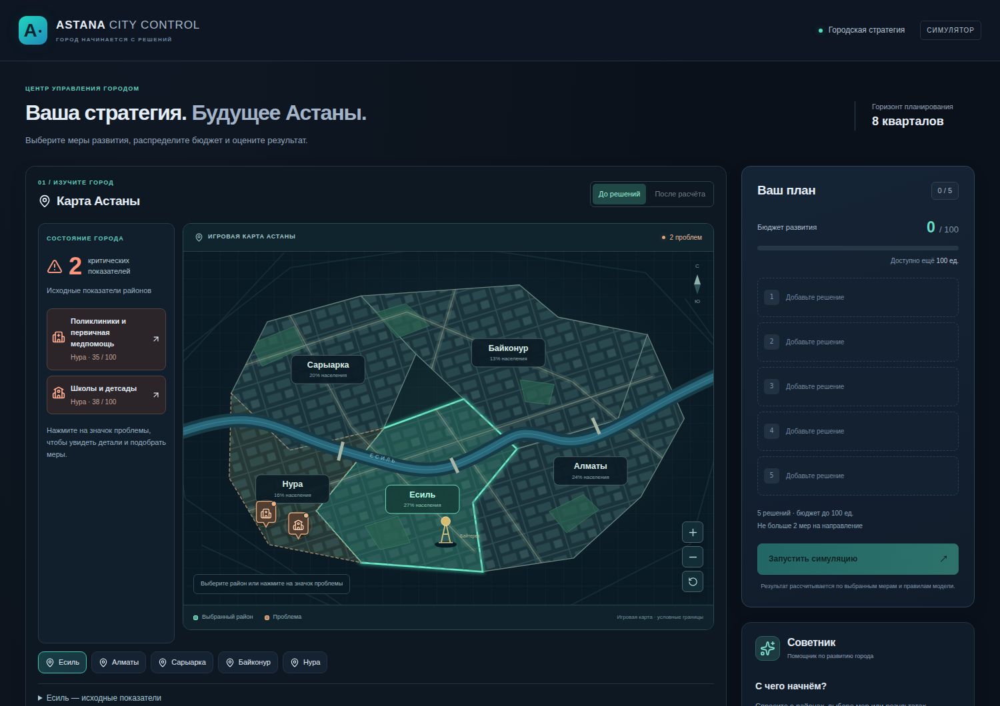
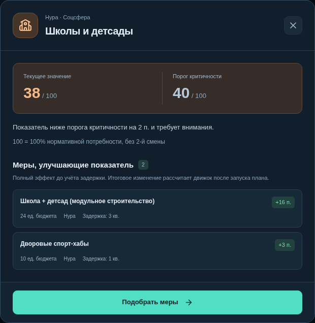
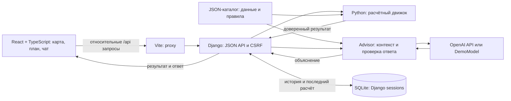

# Аким на 5 часов — Astana City Control

**Учебный симулятор городских решений с интерактивной картой, расчётным движком и AI-советником.** Проект команды **K-On!** для спецтрека **Astana Innovations**.

Игрок выбирает пять мер развития Астаны в пределах ограниченного бюджета и проверяет, как они изменят положение районов за восемь кварталов. Движок рассчитывает последствия, а AI помогает понять результат и ограничения выбранных решений.

**5 районов · 10 показателей · 14 мер · бюджет 100 условных единиц · горизонт 8 кварталов.**



[Запуск](#запуск-с-чистого-клона) · [Сценарий проверки](#демонстрационный-сценарий) · [Архитектура](#архитектура-и-технологии) · [Роль AI](#как-используется-ai) · [Тесты](#проверка-решения) · [Ограничения](#границы-текущей-версии)

## Задача и ценность

При выборе городских инициатив недостаточно сравнить их стоимость: меры действуют с задержкой, могут конфликтовать или усиливать друг друга, а улучшение среднего показателя не обязательно помогает наиболее уязвимому району. Проект делает эти зависимости видимыми в одном сценарии: **проблема на карте → выбор мер → расчёт → сравнение → объяснение**.

Симулятор подходит для учебных занятий, командных обсуждений и демонстрации принципов распределения ресурсов. Игрок видит, почему нужно учитывать не только общий результат, но и слабейший район и критические дефициты. Применение для реального муниципального планирования потребует актуальных данных и проверки модели; такая проверка пока не проводилась.

## Что реализовано

- **Карта районов:** выбор мышью или клавиатурой, масштабирование, отметки выбранных мер и значки критических проблем.
- **Окна проблем:** значение показателя, порог критичности и подходящие меры с ценой, полным эффектом и задержкой. Кнопка «Подобрать меры» выбирает район и фильтрует каталог.
- **План решений:** выбор районных и общегородских мер, учёт бюджета, проверка повторов, направлений и конфликтов.
- **Симуляция:** серверный расчёт баллов, бюджета, синергий, критических показателей и изменений относительно исходного состояния.
- **Сравнение:** переключатель «До решений / После расчёта», таблица показателей районов и предупреждение, если черновик плана изменён после расчёта.
- **AI-советник:** консультация по каталогу, объяснение результата и последующий диалог с учётом серверной истории. При сбое AI успешный расчёт сохраняется.

<details>
<summary>Пример окна проблемы: школы и детсады Нуры</summary>



</details>

## Проверка по критериям хакатона

| Критерий | Вес | Что предъявляет проект | Как проверить |
| --- | ---: | --- | --- |
| Соответствие задаче и работоспособность | 25 | Полный сценарий от проблемы района до расчёта плана и объяснения результата | Пройти [демонстрационный сценарий](#демонстрационный-сценарий) и сравнить числа |
| Техническая реализация | 25 | React-интерфейс, Django API, независимый расчётный движок, адаптер AI, серверные сессии и валидация | Изучить [архитектуру](#архитектура-и-технологии), [роль AI](#как-используется-ai) и запустить тесты |
| README и воспроизводимость | 25 | Запуск с чистого клона, режим без ключа, контрольный план, ожидаемые результаты и команды проверки | Выполнить [инструкцию запуска](#запуск-с-чистого-клона) и [проверки](#проверка-решения) |
| Ценность и применимость | 15 | Наглядное изучение бюджетных ограничений, отложенных эффектов и неравномерности развития районов | Сравнить исходное состояние и результат, обсудить [сценарии применения](#задача-и-ценность) |
| Потенциал развития и оригинальность подхода | 10 | Связка карты проблем, проверяемого расчёта и объяснения; учёт слабейшего района и критических дефицитов | Ознакомиться с [направлениями развития](#направления-развития) и обозначенными ограничениями |

Вес критериев приведён из условий оценки; таблица показывает материалы для проверки, а не присваивает проекту баллы.

## Запуск с чистого клона

### Требования

| Компонент | Требование |
| --- | --- |
| Python | 3.12 или новее; проверено на 3.14.4 |
| Node.js | 22.18 или новее; проверено на 24.21.0 |
| npm и Git | Для установки зависимостей и получения репозитория |
| Интернет | Для клонирования и установки зависимостей; для настоящего AI — также во время работы |

SQLite используется как локальная база данных; отдельный сервер БД не нужен. После установки зависимостей режим `demo` работает без внешнего AI-сервиса. Каталоги `.venv`, `node_modules`, `.tools` и файл `.env` не входят в репозиторий — их наличие на компьютере автора не требуется для запуска.

Команды ниже рассчитаны на Linux/macOS. В Windows можно использовать WSL либо запускать backend и frontend в отдельных терминалах, активировав окружение через `.venv\Scripts\Activate.ps1`.

### 1. Получить код и установить зависимости

```bash
git clone https://github.com/BAITC-Hacks/hack-1ce365d5-k-on.git
cd hack-1ce365d5-k-on

git switch main
python3 -m venv .venv
source .venv/bin/activate
python -m pip install -r requirements.txt
npm ci
```

Для закрытого репозитория нужен доступ к нему в GitHub. Версии Python-зависимостей закреплены в [requirements.txt](requirements.txt), JavaScript-зависимостей — в [package-lock.json](package-lock.json).

### 2. Подготовить окружение и базу

В новом клоне создайте `.env` из примера:

```bash
cp .env.example .env
python manage.py migrate
```

Если `.env` уже существует, сохраните его настройки. Для первого запуска измените в нём одну строку:

```dotenv
AKIM_AI_PROVIDER=demo
```

Django автоматически читает `.env`. Переменные, уже заданные в окружении процесса, имеют приоритет. Каталог и настоящий расчётный движок подключены по умолчанию; API-ключ для них не требуется.

### 3. Запустить два процесса

В первом терминале, с активированным `.venv`:

```bash
python manage.py runserver 127.0.0.1:8000
```

Во втором терминале, из корня проекта:

```bash
npm run dev -- --host 127.0.0.1
```

Откройте **http://127.0.0.1:5173** — или адрес, напечатанный Vite, если порт занят. Интерфейс работает через Vite; Django на порту `8000` обслуживает `/api`, а не главную страницу приложения.

После установки зависимостей на Linux с Bash 4.3+ оба процесса можно запускать одной командой:

```bash
./scripts/dev.sh
```

Скрипт применяет миграции при запуске нового backend, учитывает `DJANGO_API_TARGET` и может использовать уже работающий Django. `Ctrl+C` останавливает процессы, запущенные самим скриптом. Если backend был запущен отдельно, его нужно остановить отдельно.

### 4. Подключить настоящий AI

Для настоящих ответов замените настройки в `.env` и перезапустите Django:

```dotenv
AKIM_AI_PROVIDER=openai
OPENAI_API_KEY=<ваш_API_ключ>
OPENAI_MODEL=<идентификатор_доступной_вам_модели>
```

Адаптер использует OpenAI Responses API со структурированным JSON-ответом. Нужна модель с поддержкой этого формата; конкретная модель автоматически не выбирается. Ключ остаётся на сервере и не должен попадать в Git или переменные с префиксом `VITE_`. Запросы к внешнему сервису могут тарифицироваться провайдером.

**Режим `demo` — заранее написанный пример ответа, а не языковая модель.** Он нужен для проверки интерфейса и передачи данных. Его текст общий и не интерпретирует конкретный расчёт; числовые результаты в этом режиме всё равно вычисляет настоящий Python-движок. Интерфейс помечает такие ответы как «ДЕМО».

## Демонстрационный сценарий

Сценарий проверяется без ключа, с `AKIM_AI_PROVIDER=demo`. Настоящий AI можно включить отдельно для оценки качества объяснений.

1. Откройте карту. В Нуре отмечены две критические проблемы: **школы и детсады — 38**, **поликлиники — 35** при пороге **40**.
2. Нажмите на значок школы или больницы. Проверьте значение, описание и список мер. «Подобрать меры» открывает каталог с фильтром по проблеме.
3. Сбросьте фильтр проблемы крестиком, оставьте «Все направления» и соберите план из таблицы. Для первых трёх мер выберите район **Нура**. Для городской меры район не нужен. Перед добавлением M5 выберите **Сарыарку**.
4. Нажмите **«Запустить симуляцию»**. Проверьте балл, бюджет и число критических показателей в разделе «Прогноз развития».
5. Переключите карту между **«До решений»** и **«После расчёта»**. После расчёта обе критические отметки Нуры исчезают. Раскройте таблицу показателей районов для проверки изменений.
6. В режиме настоящего AI спросите: «Какие слабые места остались у этого плана?» Измените одну меру: интерфейс отметит, что показанный результат относится к предыдущему расчёту. Запустите симуляцию повторно для нового результата.

В карточках интерфейса используются названия мер; ID ниже нужны для сопоставления с API и каталогом.

| ID | Мера | Область действия | Стоимость |
| --- | --- | --- | ---: |
| M7 | Школа + детсад (модульное строительство) | Нура | 24 |
| M8 | Центр семейного здоровья / поликлиника | Нура | 20 |
| M10 | Освещение и камеры (расширение Safe City) | Нура | 12 |
| M12 | Единая цифровая платформа обращений | Весь город | 14 |
| M5 | Перевод частного сектора на чистое топливо | Сарыарка | 25 |

**Ожидаемый результат для включённого каталога:**

| Показатель | До решений | После расчёта |
| --- | ---: | ---: |
| Общий балл | 52.6151 | **56.5697** |
| Критические показатели | 2 | **0** |
| Школы и детсады Нуры, S1 | 38 | **48** |
| Поликлиники Нуры, S2 | 35 | **43.75** |

Стоимость плана — **95**, остаток — **5**, прирост балла — **3.9546**. Интерфейс округляет балл до **56,57**, прирост — до **+3,95**. Это контрольный пример, а не утверждение об оптимальном плане.

## Архитектура и технологии



| Компонент | Реализация и ответственность |
| --- | --- |
| Интерфейс | React 19, TypeScript 6, Vite 8; React hooks для состояния, SVG-карта и Lucide для иконок |
| API | Django 6.1.1; чтение JSON, проверка полей/ID, вызов движка и советника, согласованные ошибки |
| Расчёт | Отдельный Python-модуль без зависимости от LLM; эффект мер, правила, синергии, баллы и исходное состояние |
| AI | `akim_ai.Advisor`, шаблоны инструкций, JSON Schema и сменный адаптер модели |
| Данные | Версионируемый [JSON-каталог](akim_ai/catalog.json) с районами, индикаторами, мерами и правилами |
| Состояние игрока | Анонимная cookie-сессия Django; последний расчёт и до 20 успешных пар сообщений в SQLite |
| Проверки | Django/unittest, встроенный тестовый раннер Node.js, TypeScript и Oxlint |

### Взаимодействие компонентов

| Маршрут | Назначение |
| --- | --- |
| `GET /api/catalog` | Возвращает каталог и устанавливает CSRF-cookie |
| `POST /api/simulate` | Принимает пять пар `measure_id` / `district_id`, считает результат и запрашивает объяснение |
| `POST /api/advisor/chat` | Принимает только `message`; история и доверенный результат берутся из серверной сессии |

Для общегородской меры передаётся `district_id: null`. Браузер не может передать свой Score как результат движка. Клиентская проверка помогает игроку собрать план, а обязательная серверная проверка защищает расчёт от некорректных запросов.

Vite проксирует `/api` в Django с сохранением пары Host/Origin; запросы используют cookie и CSRF-токен. В интерфейсе одновременно выполняется не более одного запроса симуляции или чата. Успешная новая симуляция начинает новый диалог; ошибка движка сохраняет предыдущий расчёт. При ошибке AI уже полученный результат движка остаётся доступен.

Форматы запросов, ответов и ошибок: [контракт API](docs/api.md).

### Расчётная модель

План должен содержать ровно **пять разных мер**, стоить не более **100** единиц и включать не более **двух мер одного направления**. Движок проверяет глобальные и районные конфликты из каталога.

Эффект меры к концу горизонта:

```text
реализованный эффект = полный эффект × (8 − задержка) / 8
Score = 0.7 × средний балл с весами населения
      + 0.3 × минимальный балл района
      − число критических показателей
```

Баллы районов — средние десяти индикаторов. Критическим считается каждое значение **строго ниже 40**. Синергии применяются один раз, итоговые индикаторы ограничиваются диапазоном 0–100, остаток бюджета не даёт бонуса. Порядок добавления мер не меняет результат.

Равные веса индикаторов внутри района, ограничение значений после суммирования эффектов и применение синергий без дополнительной задержки — явно принятые допущения. Формулы, подробности и числовые тесты описаны в [документации движка](docs/engine.md).

## Как используется AI

В веб-приложении советник получает вопрос игрока, каталог, историю успешных сообщений и последний **серверный** результат симуляции. До первого расчёта он консультирует по каталогу. Несохранённый черновик плана из браузера в чат не передаётся.

LLM формирует структурированный брифинг: краткое объяснение, сильные стороны, риски и следующий шаг. Код проверяет JSON-структуру и существование ссылок `evidence_ids`, после чего преобразует брифинг в текст для интерфейса. Модель не рассчитывает баллы и не применяет решения за игрока. Проверка ссылок на факты не гарантирует смысловую точность каждого утверждения — качество текста требует отдельной оценки.

В библиотеке есть ограниченный агентный сценарий с `suggest=true`: модель предлагает до трёх наборов, код проверяет их состав, а при переданном серверном симуляторе рассчитывает допустимые варианты и возвращает результаты модели для объяснения. **Этот подбор кандидатов пока не подключён к веб-интерфейсу.** CLI без переданного симулятора помечает предложения как `unverified`. Здесь используется управляемая программой последовательность вызовов, а не нативный function calling провайдера.

Примеры независимого запуска библиотеки без API-ключа:

```bash
python -m akim_ai --provider demo --input examples/request.json
python -m akim_ai --provider demo --input examples/plan.json
```

CLI читает переменные процесса и не загружает `.env`; Django загружает его автоматически. Подробнее: [руководство Advisor](docs/advisor.md).

## Проверка решения

Из корня проекта, с активированным Python-окружением:

```bash
python manage.py check
python manage.py test
npm test
npm run lint
npm run build
```

При подготовке этой документации прошли **71 backend-тест и 13 frontend-тестов**, проверка типов, lint и production-сборка. Автоматические тесты используют заглушки или `demo` и не делают платных вызовов AI.

| Что проверяется | Где находятся проверки |
| --- | --- |
| Формулы, задержки, синергии, бюджет, конфликты, границы и критический порог | [game_api/test_engine.py](game_api/test_engine.py) |
| API, CSRF, сессии, изоляция игроков и сохранение результата при ошибках | [game_api/tests.py](game_api/tests.py), [интеграция Advisor](game_api/test_logic_integration.py) |
| Загрузка `.env` и приоритет окружения | [game_api/test_environment.py](game_api/test_environment.py) |
| AI-контракты, неподтверждённые кандидаты и ошибочные ответы | [tests/test_agent.py](tests/test_agent.py) |
| API-клиент, план и критические проблемы карты | [frontend-tests](frontend-tests) |

Контрольный план можно проверить прямо через движок, без браузера и внешнего AI:

```bash
python manage.py shell <<'PY'
from game_api.engine import simulate

plan = [
    {"measure_id": "M7", "district_id": "NURA"},
    {"measure_id": "M8", "district_id": "NURA"},
    {"measure_id": "M10", "district_id": "NURA"},
    {"measure_id": "M12", "district_id": None},
    {"measure_id": "M5", "district_id": "SARYARKA"},
]
result = simulate(decisions=plan)
assert abs(result["score"] - 56.5697) < 1e-9
assert result["budget_spent"] == 95
assert result["critical_count"] == 0
print("OK:", result["score"], result["budget_remaining"])
PY
```

Для проверки HTTP-маршрутов с CSRF и сессией без запуска внешнего сервера:

```bash
python manage.py test game_api.test_engine.ScoringAPIIntegrationTests
```

Дополнительно в браузере проверялись выбор районов, окна проблем, подбор мер, расчёт, изменение отметок на карте, повторные запросы и мобильная раскладка. Эти ручные/browser-проверки не входят в `npm test`; основной путь для их воспроизведения приведён выше.

### Если запуск не удался

| Симптом | Что проверить |
| --- | --- |
| Страница Django на `8000` возвращает 404 | Откройте интерфейс на адресе Vite, обычно `http://127.0.0.1:5173` |
| Каталог не загружается / «неожиданный ответ сервера» | Откройте `/api/catalog` на порту Vite: ответ должен быть JSON. Убедитесь, что Django запущен; перезапустите Vite после переключения веток или изменения его конфигурации |
| `npm: command not found` | Установите Node.js требуемой версии и перезапустите терминал |
| Ошибка таблицы сессий | Выполните `python manage.py migrate` в нужном окружении |
| Порт занят | Используйте уже запущенный процесс или остановите его. Адрес frontend смотрите в выводе Vite; для другого backend задайте `DJANGO_API_TARGET` в `.env` |
| Симуляция работает, но советник недоступен | Для воспроизводимой демонстрации используйте `demo`; для реального AI проверьте ключ, модель и доступность сервиса, затем перезапустите Django. Таймаут внешнего запроса — 45 секунд |
| Изменения Python или `.env` не подхватились | Перезапустите backend: объединённый launcher запускает его без autoreload и может переиспользовать уже работающий сервер |

## Структура репозитория

```text
src/                  React-интерфейс, API-клиент и проверки плана
  components/         карта, иконки направлений, окно проблемы
game_api/             Django API, расчётный движок и интеграционные тесты
akim_ai/              Advisor, провайдеры модели, контракты и каталог
ThisIsTheAstana/       настройки и маршруты Django
frontend-tests/       тесты API-клиента, плана и проблем карты
tests/                тесты библиотеки Advisor
examples/             примеры запросов к CLI
docs/                 API, формулы, руководство Advisor и скриншоты
scripts/dev.sh        совместный запуск backend и frontend
.env.example          шаблон настроек без секретов
```

## Границы текущей версии

- Данные описывают учебную модель, а не текущее состояние города. Весь используемый каталог включён в репозиторий; живых городских потоков данных нет.
- Карта иллюстративная, с условными границами. Текущие карта и AI-контракты рассчитаны на пять районов и идентификаторы включённого каталога.
- Результаты детерминированы правилами модели, но не являются подтверждённым прогнозом реальных муниципальных эффектов. Полный поиск оптимального плана не выполняется.
- Нет пользовательского входа в игровом интерфейсе, сохранённой библиотеки сценариев или экспорта. При перезагрузке страницы состояние интерфейса сбрасывается; серверная сессия может сохранять предыдущий расчёт и диалог, но их восстановление в UI ещё не реализовано.
- AI может ошибаться или быть недоступен. Числовые результаты следует проверять по движку; `demo` демонстрирует только путь данных и заранее заданный ответ.
- Конфигурация предназначена для локальной демонстрации. Для публикации потребуется настроить секреты Django, `DEBUG`, допустимые хосты, HTTPS и production-сервер. `npm run build` создаёт `dist/`; `npm run preview` проверяет сборку локально при работающем Django. В развёрнутом приложении frontend и `/api` должны быть доступны с одного origin.

## Направления развития

| Следующий шаг | Практический результат |
| --- | --- |
| Подключить генерацию и проверку кандидатов к UI | Игрок сравнивает несколько предложенных планов с результатами движка и сам выбирает вариант |
| Сохранение, сравнение и экспорт сценариев | Можно вернуться к решениям и показать аргументы команде или преподавателю |
| Уточнить данные и откалибровать эффекты с экспертами | Появится основание оценивать применимость модели вне учебной демонстрации |
| Добавить реальные геоданные и обобщить контракты каталога | После проверки модели можно адаптировать интерфейс к другим городам и наборам районов |
| Оценивать качество объяснений, добавить наблюдаемость и настройки развёртывания | Повысится надёжность работы с настоящим AI и готовность к пилотному использованию |

Особенность подхода — связь каждого шага с проверяемыми данными: значок на карте показывает конкретный дефицит, окно проблемы выводит меры с подходящим эффектом, числовое изменение рассчитывает движок, а AI объясняет полученные факты. Средний городской балл дополняется вкладом слабейшего района и штрафом за критические показатели, поэтому улучшения распределения ресурсов видны отдельно от роста среднего значения.

## Команда

| Участник | Зона ответственности |
| --- | --- |
| Erasyl | Расчётный движок и Django API |
| Temirlan | Логика AI-советника |
| Miras | Дизайн и React-интерфейс |
